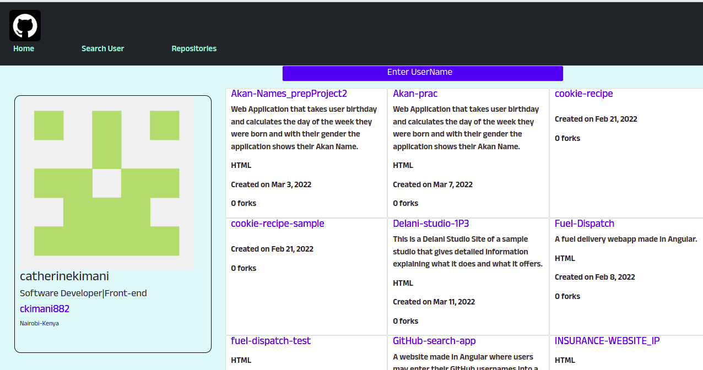

# GitHubSerchApp

#### By Catherine Kimani

## Table Of Content

+ [Description](#description)
+ [Installation Requirement](#Installation)
+ [Technology Used](#technology-used)
+ [Licence](#licence)
+ [Authors Info](#author-Info)

## Description 
A website made in Angular where users may enter their GitHub usernames into a form, submit it, and see names and descriptions of their public repositories.

## Installation

### Requirements

* Make sure you have access to a computer
* make sure you have access to the internet
* Create a GitHub account

[Go back to the top](#githubserchapp)

## Technologies Used

* HTML - Which was used to build the structure of the page
* CSS - Which was used for styling and layout
* Typescript - Which was used to for the site's logic and functionality

## Licence

Copyright (c) [2022] [Catherine Kimani](LICENCE)

## Authors Info

linked - [Catherine Kimani](https://www.linkedin.com/in/catherine-kimani-5464ba1b6/)
Email - [Catherine Kimani](catherinekimani882@gmail.com)

This project was generated with [Angular CLI](https://github.com/angular/angular-cli) version 13.3.0.

## Development server

Run `ng serve` for a dev server. Navigate to `http://localhost:4200/`. The application will automatically reload if you change any of the source files.

## Code scaffolding

Run `ng generate component component-name` to generate a new component. You can also use `ng generate directive|pipe|service|class|guard|interface|enum|module`.

## Build

Run `ng build` to build the project. The build artifacts will be stored in the `dist/` directory.

## Running unit tests

Run `ng test` to execute the unit tests via [Karma](https://karma-runner.github.io).

## Running end-to-end tests

Run `ng e2e` to execute the end-to-end tests via a platform of your choice. To use this command, you need to first add a package that implements end-to-end testing capabilities.

## Further help

To get more help on the Angular CLI use `ng help` or go check out the [Angular CLI Overview and Command Reference](https://angular.io/cli) page.
